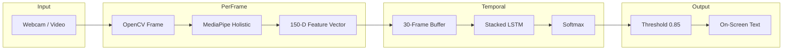
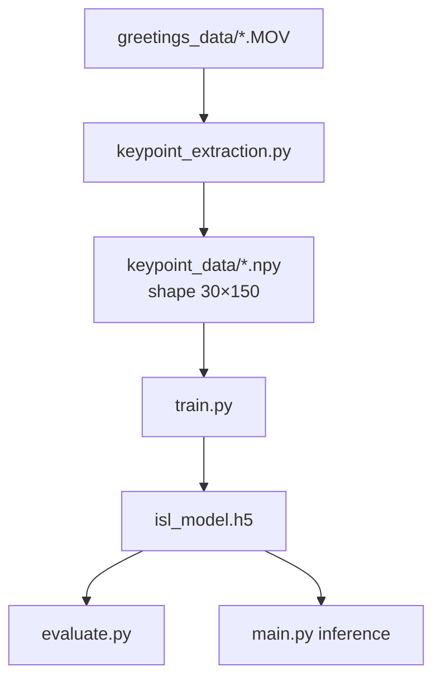
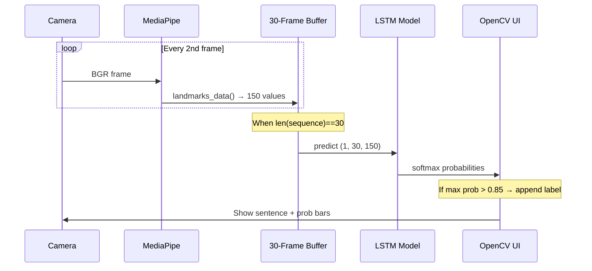

# Real-Time Indian Sign Language (ISL) Translation

A real-time **isolated gesture recognition** system that converts Indian Sign Language greetings into on-screen text. The pipeline uses **OpenCV** for video capture, **MediaPipe Holistic** for skeleton keypoints, and a **stacked LSTM** (TensorFlow/Keras) to classify temporal gesture sequences.

> **Scope:** This project recognizes **isolated signs** (single words/phrases), not continuous sentence-level ISL. Supported classes are limited to the gestures in `greetings_data/`.

---

## Table of Contents

- [Problem & Motivation](#problem--motivation)
- [Key Features (Interview Highlights)](#key-features-interview-highlights)
- [System Architecture](#system-architecture)
- [Feature Engineering (150-D per Frame)](#feature-engineering-150-d-per-frame)
- [Model Architecture](#model-architecture)
- [Project Structure](#project-structure)
- [Setup & Installation](#setup--installation)
- [How to Run (End-to-End)](#how-to-run-end-to-end)
- [Design Decisions](#design-decisions)
- [Evaluation Metrics](#evaluation-metrics)
- [Limitations & Future Work](#limitations--future-work)
- [References](#references)

---

## Problem & Motivation

Hearing-impaired individuals often communicate through sign language, while many others do not. This project **bridges that gap** by translating performed ISL gestures into readable text in real time—using only a standard webcam, without specialized hardware.

---

## Key Features (Interview Highlights)

| Feature | What it does | Why it matters |
|--------|----------------|----------------|
| **Holistic landmark extraction** | Pose (33) + left hand (21) + right hand (21) → 150 features/frame | Captures **body + both hands**; sign language is not finger-only |
| **Preprocessed `.npy` cache** | One-time video → MediaPipe → disk | Training reloads in seconds instead of re-running MediaPipe for hours |
| **Fixed 30-frame sequences** | ~1 s of motion at 30 FPS (every 2nd frame sampled) | Consistent LSTM input shape `(30, 150)` |
| **Zero-padding for missing parts** | Missing pose/hand → zeros | Robust when MediaPipe fails to detect a limb |
| **Confidence threshold (0.85)** | Rejects low softmax scores | Reduces false positives; returns implicit “unknown” |
| **Multiple LSTM variants** | `lstm_v1`, `lstm_v2`, `lstm_v3` + experimental **Transformer** | Shows architecture exploration and trade-off reasoning |
| **Training callbacks** | `ModelCheckpoint`, `ReduceLROnPlateau` | Best weights saved; adaptive learning rate |
| **Live probability overlay** | Per-class % on video frame | Debuggable, demo-friendly UI |
| **Sentence buffer** | Last 5 unique predictions | Simple sequence of recognized greetings on screen |

---

## System Architecture

### High-level pipeline



### Offline training pipeline



### LSTM inference flow (real-time)



---

## Feature Engineering (150-D per Frame)

MediaPipe **Holistic** provides:

| Component | Landmarks | Coordinates used | Values |
|-----------|-----------|------------------|--------|
| Pose | 33 | x, y | 66 |
| Left hand | 21 | x, y | 42 |
| Right hand | 21 | x, y | 42 |
| **Total** | | | **150** |

**Not used in this project:** face landmarks (468×3) — would add cost and little gain for isolated greetings; body + hands are sufficient.

**Missing detections:** If pose or a hand is not found, that block is filled with **zeros** (see `landmarks_data()` in `utils.py`).

**Per video sample:** 30 frames → tensor shape **`(30, 150)`**, saved via `np.save()`.

**Why `.npy` instead of raw video?**

- One RGB frame at 640×480×3 ≈ 921,600 values vs **150** after MediaPipe — massive compression.
- Training repeatedly loads arrays from disk without re-running detection.

---

## Model Architecture

Default production model: **`lstm_v3`** (see `models/lstm_v3/info.txt`).

```
Input (30, 150)
    → LSTM(64, return_sequences=True)
    → LSTM(256, return_sequences=True)
    → LSTM(128, return_sequences=False)
    → Dense(1024) → Dense(512) → Dense(128) → Dense(64)
    → Dense(num_classes, softmax)
```

**Why LSTM?** Gestures are **temporal**; CNNs/feedforward nets treat frames independently. LSTMs model motion over time via gates (forget / input / output / cell state).

**Why not Transformer here?** Implemented in `models.py` for experimentation, but with a **small dataset** and **short sequences (30)**, LSTM is lighter and less prone to overfitting. Transformers excel with large data and long-range attention.

**Confidence threshold:** `0.85` on validation — balances accepting true gestures vs rejecting uncertain predictions.

---

## Project Structure

```
Real-Time-ISL-Translation/
├── greetings_data/          # Raw videos per gesture class
├── keypoint_data/           # Generated .npy sequences (run extraction first)
├── models/
│   ├── lstm_v1/             # Architecture notes + optional .h5
│   ├── lstm_v2/
│   ├── lstm_v3/             # Best pretrained weights for inference
│   └── transformer/
├── keypoint_extraction.py   # Video → MediaPipe → .npy
├── train.py                 # Train LSTM from keypoint_data
├── evaluate.py              # Test accuracy on hold-out split
├── main.py                  # Real-time / video inference + UI
├── models.py                # LSTM v1–v3, Transformer, load_model()
├── utils.py                 # MediaPipe helpers, padding, metrics
├── isl_model.h5             # Checkpoint from training (if present)
└── interview.md             # Q&A for technical interviews
```

### Supported gesture classes (9)

`alright`, `good afternoon`, `good evening`, `good morning`, `good night`, `hello`, `how are you`, `pleased`, `thank you`

---

## Setup & Installation

### Prerequisites

- Python 3.8–3.10 (recommended; MediaPipe compatibility varies on 3.11+)
- Webcam (for live demo) or test video file

### Create environment & install dependencies

```powershell
cd Real-Time-ISL-Translation
python -m venv isl_env
.\isl_env\Scripts\Activate.ps1
pip install opencv-python mediapipe tensorflow scikit-learn numpy matplotlib scipy
```

> A pre-created `isl_env` may already exist in the repo; activate it instead of creating a new one if preferred.

---

## How to Run (End-to-End)

### Step 1 — Extract keypoints from raw videos

Processes every video in `greetings_data/<gesture>/`, samples every **2nd frame**, pads/truncates to **30 frames**, saves to `keypoint_data/`.

```powershell
python keypoint_extraction.py
```

Expected output per file: `(30, 150)` array saved as `.npy`.

### Step 2 — Train the model

```powershell
python train.py
```

- Loads all `.npy` files from `keypoint_data/`
- 90/10 train-test split
- Saves best model to `isl_model.h5` (and checkpoints during training)

To train a different architecture, change `load_model('lstm_v1', ...)` in `train.py`.

### Step 3 — Evaluate

```powershell
python evaluate.py
```

Prints model summary and **hold-out accuracy**.

### Step 4 — Run inference (demo)

```powershell
python main.py
```

- Default: reads `Test_video.mp4` (place your test file in project root, or edit `main.py`)
- **Live webcam:** change `cv2.VideoCapture('Test_video.mp4')` to `cv2.VideoCapture(0)`
- Press **`q`** to quit
- Uses pretrained **`lstm_v3`** from `models/lstm_v3/*.h5`

---

## Design Decisions

### Frame sampling (`skip_frame=2`)

At 30 FPS, using every 2nd frame yields ~15 landmark samples per second; **30 buffered frames ≈ ~2 seconds** of motion context while keeping compute low.

### Fixed length vs variable length

| Approach | Pros | Cons |
|----------|------|------|
| Fixed 30 + padding | Simple LSTM batching | Short signs padded; long signs truncated |
| Variable length + mask | Less wasted padding | Needs masking layer / Transformer attention |
| Sliding window | Good for unknown gesture location in long video | More noise for isolated signs |

This project uses **fixed 30** because the dataset contains **isolated** greeting clips.

### MediaPipe detection failure

If hands/body are off-screen or lighting is poor, landmarks are **zeroed** rather than feeding garbage coordinates—frames with no detection still produce a valid numeric vector.

### Real-time prediction gating

A prediction is shown only when:

1. Buffer has **30 frames**, and  
2. **max(softmax) > 0.85**, and  
3. Label differs from the last appended word (reduces duplicate spam)

---

## Evaluation Metrics

Used during model selection and interviews:

- **Accuracy** — overall correct classifications  
- **Precision** — of predictions labeled “hello”, how many were actually hello  
- **Recall** — of all true hellos, how many were detected  
- **F1** — harmonic mean of precision and recall  
- **Confusion matrix** — per-class error patterns  

Best recorded `lstm_v3` (see `models/lstm_v3/info.txt`): ~**91.5%** train accuracy, ~**80%** validation accuracy.

---

## Limitations & Future Work

- **Isolated signs only** — no continuous sentence translation or grammar  
- **Closed vocabulary** — only trained classes; others should map to “unknown” via threshold  
- **Signer speed variance** — fixed 30-frame window may clip slow/fast signers; improvements: adaptive windows, consecutive-confidence counters, gesture boundary detection  
- **Two-hand relational features** — relative distance/angle between hands not yet engineered (good extension story)  
- **Face landmarks** — skipped for lightweight inference; useful for questions vs statements in full SLU  
- **Production** — consider TFLite/ONNX, edge deployment, and larger diverse datasets  

---

## References

- [MediaPipe Holistic](https://google.github.io/mediapipe/solutions/holistic.html)  
- [TensorFlow LSTM](https://www.tensorflow.org/api_docs/python/tf/keras/layers/LSTM)  
- Indian Sign Language research datasets (limited availability motivates isolated-gesture focus)  

For a full list of likely interview questions and suggested answers, see **[interview.md](./interview.md)**.
